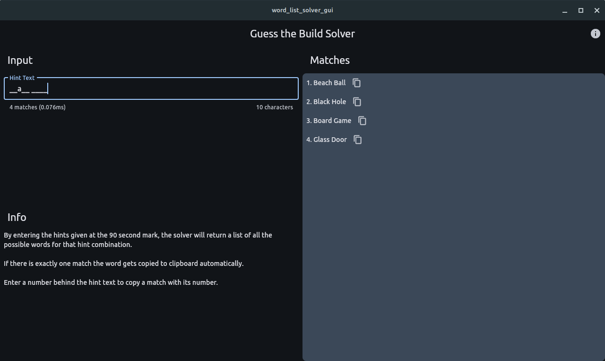

# Guess the Build Solver

Guess the Build Solver is a cross-platform GUI tool designed to help users solve "Guess the Build" theme puzzles from the Hypixel Minecraft
server by entering the hints provided in the game.

## Installation

### Windows

1. Download the setup file from the [latest release](https://github.com/Finnomator/WordListSolverGUI/releases/latest)
2. Run the downloaded file to install the tool.

### Other Platforms

1. Download the source code
2. Build it with Flutter for your device

## Usage

To use the Guess the Build Solver:

1. Enter the hints from the game into the provided text boxes.
2. The tool will automatically display words that match the hints.

You can select the dictionaries you want to use. The Hypixel words are the default.

### Methods of Copying a Match

- Method 1: Click the copy button next to the match.
- Method 2: Enter the number of the match directly after your input.
- Method 3: Specify your word. If only one match appears, it will automatically be copied to your clipboard.
